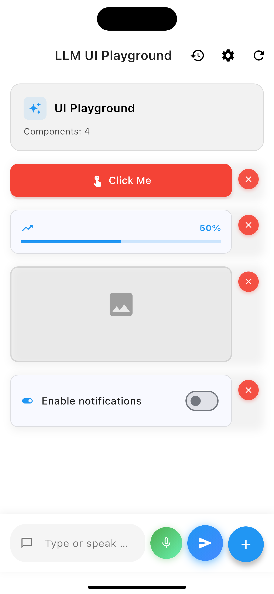

# Mobile UI Playground

A Flutter-based playground for generating and editing mobile UI layouts using natural language commands. This project demonstrates how to use LLMs (Large Language Models) and hardcoded mappings to convert user prompts into UI instructions.

## Screenshots

<p align="center">
  
  
  
</p>

## Features

- **Natural Language UI Creation:** Add buttons, containers, text fields, cards, and more using simple text commands.
- **Color and Label Extraction:** Supports color and label parsing from prompts (e.g., "add a red button labeled 'Submit'").
- **Background and Title Changes:** Change the app background color or title via commands.
- **Reset and Utility Commands:** Easily reset or clear the UI.
- **LLM Integration:** Optionally connect to an LLM service for advanced prompt handling.
- **Fallback Logic:** Uses hardcoded mappings if LLM is not configured or fails.
- **Note:** Some prompts will require online connectivity and api key config

## Example Commands

- `add a red button`
- `add button with text "Click Me"`
- `create a blue button`
- `add a green container`
- `add textfield with placeholder "Enter name"`
- `add text saying "Hello World"`
- `create large text`
- `change background to green`
- `change title to My App`
- `reset`

See more in `PromptService.getSampleCommands()`.

## Getting Started

### Prerequisites

- [Flutter](https://flutter.dev/docs/get-started/install)
- Dart SDK

### Installation

1. Clone the repository:
   ```sh
   git clone https://github.com/yourusername/mobile_ui_playground.git
   cd mobile_ui_playground
   ```

2. Install dependencies:
   ```sh
   flutter pub get
   ```

3. Run the app:
   ```sh
   flutter run
   ```

### LLM Service (Optional)

To enable LLM-based prompt parsing, configure your LLM API in `lib/services/llm_service.dart`.

## Project Structure

- `lib/services/prompt_service.dart` - Core logic for parsing prompts and generating UI instructions.
- `lib/models/` - Data models for instructions.
- `lib/services/llm_service.dart` - LLM integration (optional).
- `lib/` - Main Flutter app files.

## Contributing

Pull requests are welcome! For major changes, please open an issue first to discuss what you would like to change.

## License

[MIT](LICENSE)